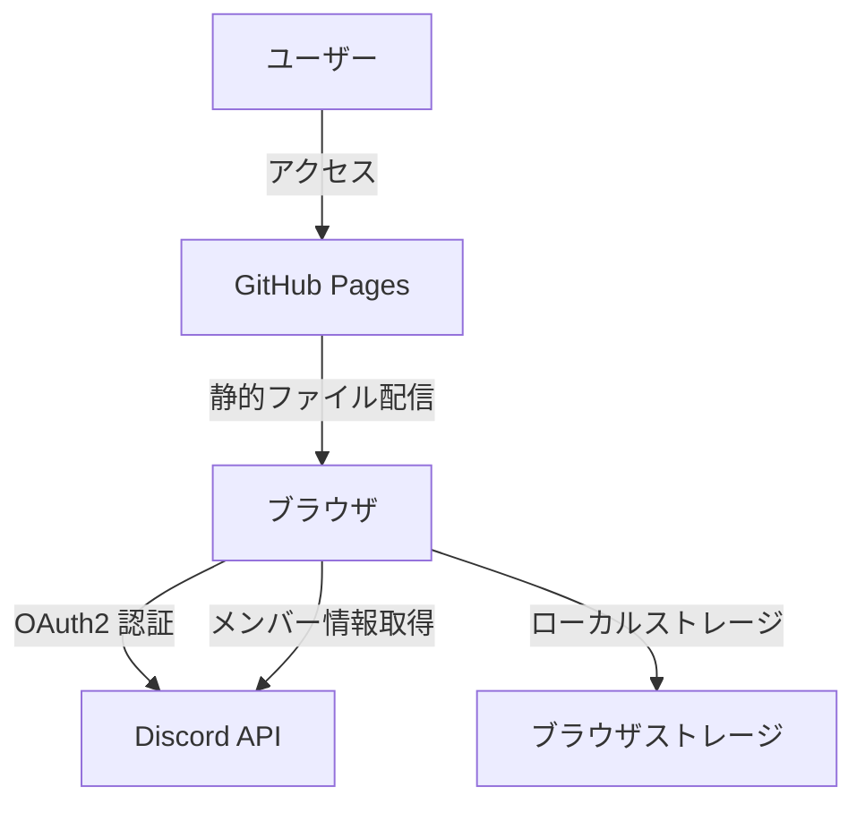
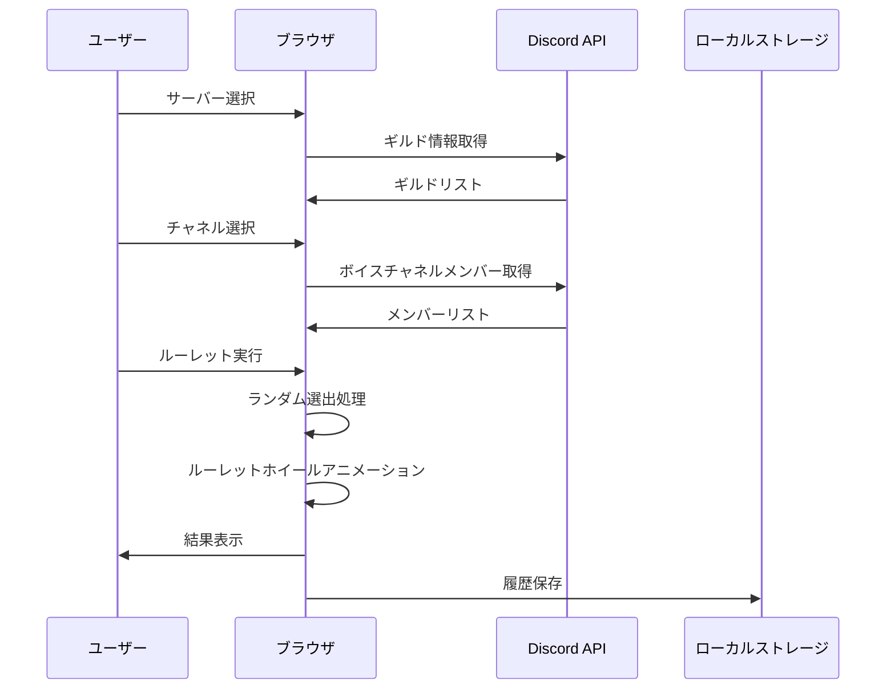

# 設計書

## 概要

Discord ボイスルーレットアプリケーションは、Discord API を利用してボイスチャネルのメンバー情報を取得し、指定人数をランダムに選出する完全クライアントサイドの Web アプリケーションです。GitHub Pages での静的ホスティングを前提とし、サーバーレスアーキテクチャを採用します。

### 技術スタック

- **フロントエンド**: HTML5、CSS3、JavaScript (ES6+)
- **UI フレームワーク**: なし（Vanilla JS）または軽量フレームワーク（検討中）
- **Discord 統合**: Discord OAuth2、Discord REST API
- **ホスティング**: GitHub Pages
- **ビルドツール**: なし（静的ファイルのみ）または軽量バンドラー（検討中）

## アーキテクチャ

### システム構成



### アーキテクチャの特徴

1. **完全クライアントサイド**: すべての処理がブラウザ内で完結
2. **サーバーレス**: バックエンドサーバー不要
3. **ステートレス**: サーバー側でのセッション管理なし
4. **セキュア**: トークンはブラウザのローカルストレージのみに保存

### データフロー



注: 将来的に Discord OAuth2 認証を実装する場合、このフローの前に認証ステップが追加されます。

## コンポーネントとインターフェース

### 1. Discord API クライアント (DiscordClient)

Discord REST API との通信を担当します。

#### 責務
- Discord API へのリクエスト送信
- レート制限の処理
- エラーハンドリング
- レスポンスのパース

#### インターフェース

```javascript
class DiscordClient {
  /**
   * コンストラクタ
   * @param {string} token - アクセストークン
   */
  constructor(token)

  /**
   * ユーザーがアクセス可能なギルドを取得
   * @returns {Promise<Guild[]>} ギルドリスト
   */
  async getGuilds()

  /**
   * 指定ギルドのチャネルリストを取得
   * @param {string} guildId - ギルド ID
   * @returns {Promise<Channel[]>} チャネルリスト
   */
  async getChannels(guildId)

  /**
   * 指定ボイスチャネルのメンバーリストを取得
   * @param {string} guildId - ギルド ID
   * @param {string} channelId - チャネル ID
   * @returns {Promise<Member[]>} メンバーリスト
   */
  async getVoiceChannelMembers(guildId, channelId)

  /**
   * API リクエストを実行
   * @param {string} endpoint - API エンドポイント
   * @param {Object} options - リクエストオプション
   * @returns {Promise<Object>} レスポンス
   */
  async request(endpoint, options)
}
```

### 2. ルーレットエンジン (RouletteEngine)

メンバーのランダム選出ロジックを実装します。

#### 責務
- メンバーリストからのランダム選出
- 選出人数のバリデーション
- 公平性の保証（均等確率）

#### インターフェース

```javascript
class RouletteEngine {
  /**
   * メンバーリストから指定人数をランダムに選出
   * @param {Member[]} members - メンバーリスト
   * @param {number} count - 選出人数
   * @returns {Member[]} 選出されたメンバー
   * @throws {Error} 無効な選出人数の場合
   */
  selectMembers(members, count)

  /**
   * 選出人数のバリデーション
   * @param {number} count - 選出人数
   * @param {number} totalMembers - 総メンバー数
   * @returns {boolean} 有効かどうか
   */
  validateCount(count, totalMembers)

  /**
   * Fisher-Yates シャッフルアルゴリズム
   * @param {Array} array - シャッフル対象の配列
   * @returns {Array} シャッフルされた配列
   */
  shuffle(array)
}
```

### 3. UI コントローラー (UIController)

ユーザーインターフェースの状態管理と更新を担当します。

#### 責務
- UI の状態管理
- ユーザー入力の処理
- 画面遷移の制御
- アニメーション効果の管理
- ルーレットホイールコンポーネントの管理

#### インターフェース

```javascript
class UIController {
  /**
   * ギルド選択画面を表示
   * @param {Guild[]} guilds - ギルドリスト
   * @returns {void}
   */
  showGuildSelection(guilds)

  /**
   * チャネル選択画面を表示
   * @param {Channel[]} channels - チャネルリスト
   * @returns {void}
   */
  showChannelSelection(channels)

  /**
   * メンバーリストとルーレット画面を表示
   * @param {Member[]} members - メンバーリスト
   * @returns {void}
   */
  showRouletteScreen(members)

  /**
   * ルーレット結果を表示
   * @param {Member[]} selectedMembers - 選出されたメンバー
   * @returns {void}
   */
  showResults(selectedMembers)

  /**
   * ローディング表示
   * @param {boolean} show - 表示するかどうか
   * @returns {void}
   */
  showLoading(show)

  /**
   * エラーメッセージを表示
   * @param {string} message - エラーメッセージ
   * @returns {void}
   */
  showError(message)

  /**
   * ルーレットアニメーションを実行
   * RouletteWheelコンポーネントを使用して円グラフ型のルーレットアニメーションを表示
   * @param {Member[]} members - 全メンバー
   * @param {Member[]} selected - 選出されたメンバー
   * @returns {Promise<void>}
   */
  async animateRoulette(members, selected)
}
```

### 5. RouletteWheel コンポーネント

円グラフ型のルーレットホイールを描画し、回転アニメーションを実行します。

#### 責務
- Canvas を使用したルーレットホイールの描画
- メンバーごとのセクション（扇形）の描画
- 回転アニメーションの実行
- 選出されたメンバーへの針の停止

#### インターフェース

```javascript
class RouletteWheel {
  /**
   * コンストラクタ
   * @param {HTMLElement} container - ルーレットを表示するコンテナ要素
   */
  constructor(container)

  /**
   * ルーレットを初期化
   * @param {Member[]} members - メンバーリスト
   * @returns {void}
   */
  initialize(members)

  /**
   * ルーレットを描画
   * @returns {void}
   */
  draw()

  /**
   * 針を描画（上部に固定）
   * @param {number} centerX - 中心X座標
   * @param {number} centerY - 中心Y座標
   * @param {number} radius - 半径
   * @returns {void}
   */
  drawPointer(centerX, centerY, radius)

  /**
   * ルーレットを回転させて選出されたメンバーに停止
   * @param {Member} selectedMember - 選出されたメンバー
   * @returns {Promise<void>}
   */
  async spin(selectedMember)

  /**
   * アニメーションを停止
   * @returns {void}
   */
  stop()

  /**
   * ルーレットを破棄
   * @returns {void}
   */
  destroy()
}
```

#### 実装の特徴

- **Canvas API**: HTML5 Canvas を使用した高性能な描画
- **カラフルな表示**: メンバーごとに異なる色のセクションを表示
- **スムーズなアニメーション**: イージング関数を使用した減速アニメーション
- **複数回転**: 3〜5回転してから選出されたメンバーに停止
- **固定された針**: 上部に赤い三角形の針を固定し、ホイールが回転

### 6. アプリケーションコントローラー (AppController)

アプリケーション全体のフローを制御します。

#### 責務
- 各モジュールの初期化と連携
- アプリケーションフローの管理
- イベントハンドリング

#### インターフェース

```javascript
class AppController {
  /**
   * コンストラクタ
   */
  constructor()

  /**
   * アプリケーションを初期化
   * @returns {Promise<void>}
   */
  async initialize()

  /**
   * ギルド選択を処理
   * @param {string} guildId - 選択されたギルド ID
   * @returns {Promise<void>}
   */
  async handleGuildSelection(guildId)

  /**
   * チャネル選択を処理
   * @param {string} channelId - 選択されたチャネル ID
   * @returns {Promise<void>}
   */
  async handleChannelSelection(channelId)

  /**
   * ルーレット実行を処理
   * @param {number} count - 選出人数
   * @returns {Promise<void>}
   */
  async handleRouletteExecution(count)
}
```

## 現在の実装状況

### 実装済み機能

1. **チャネル選択からの開始**: 認証機能は実装されておらず、アプリケーションはチャネル選択画面から開始します
2. **ルーレットホイールアニメーション**: RouletteWheel コンポーネントが実装済みで、円グラフ型の回転アニメーションが動作します
3. **UIController の統合**: UIController に animateRoulette メソッドが実装され、RouletteWheel コンポーネントを使用しています

### 将来の拡張

#### Discord OAuth2 認証（未実装）

将来的に Discord OAuth2 認証を実装する場合、以下のコンポーネントとフローが必要になります：

**AuthModule（認証モジュール）**:
- OAuth2 認証フローの開始
- 認証コードの受け取りとトークン交換
- アクセストークンの保存と管理
- ログアウト処理

**認証フロー**:
1. ユーザーが認証ボタンをクリック
2. Discord OAuth2 認証ページにリダイレクト
3. 認証コード取得とトークン交換
4. トークンをローカルストレージに保存
5. ギルド選択画面へ遷移

**必要な変更**:
- AuthModule クラスの実装
- 認証画面の追加
- AppController への認証フロー統合（startAuth、handleLogout メソッド）
- DiscordClient へのトークン渡し

現在の実装では、これらの認証機能は省略されており、チャネル選択から直接開始する簡易版として動作しています。

## データモデル

### Guild（ギルド）

```javascript
{
  id: string,           // ギルド ID
  name: string,         // ギルド名
  icon: string | null   // アイコン URL
}
```

### Channel（チャネル）

```javascript
{
  id: string,           // チャネル ID
  name: string,         // チャネル名
  type: number,         // チャネルタイプ（2 = ボイス）
  guildId: string       // 所属ギルド ID
}
```

### Member（メンバー）

```javascript
{
  id: string,           // ユーザー ID
  username: string,     // ユーザー名
  discriminator: string,// ディスクリミネーター
  avatar: string | null,// アバター URL
  displayName: string   // 表示名（ニックネームまたはユーザー名）
}
```

### RouletteResult（ルーレット結果）

```javascript
{
  timestamp: number,        // 実行時刻（Unix タイムスタンプ）
  guildId: string,          // ギルド ID
  channelId: string,        // チャネル ID
  totalMembers: number,     // 総メンバー数
  selectedCount: number,    // 選出人数
  selectedMembers: Member[] // 選出されたメンバー
}
```

## 正確性プロパティ

プロパティとは、システムのすべての有効な実行において真であるべき特性や振る舞いのことです。これは、人間が読める仕様と機械で検証可能な正確性保証の橋渡しとなります。

### プロパティ 1: サーバー選択時のチャネルリスト取得

*任意の*有効なギルド ID に対して、システムはそのギルドに属するボイスチャネルのリストを取得し、表示する

**検証: 要件 1.4**

### プロパティ 2: チャネル選択時のメンバーリスト取得

*任意の*有効なチャネル ID に対して、システムはそのチャネルに参加している全メンバーのリストを取得し、各メンバーの表示名とアバター画像を含めて表示する

**検証: 要件 2.1, 2.2**

### プロパティ 3: 選出人数のバリデーション

*任意の*入力値に対して、システムは 1 以上かつメンバー総数以下の整数値のみを有効とし、範囲外の値は拒否してエラーメッセージを表示する

**検証: 要件 3.1, 3.2**

### プロパティ 4: ルーレット選出の正確性

*任意の*メンバーリストと有効な選出人数に対して、システムは正確に指定された人数のメンバーを選出し、重複なく返す

**検証: 要件 3.3**

### プロパティ 5: 選出確率の均等性

*任意の*メンバーリストに対して、十分な回数のルーレット実行を行った場合、各メンバーが選出される確率は統計的に均等である

**検証: 要件 3.4**

### プロパティ 6: ルーレットホイールアニメーション

*任意の*メンバーリストと選出されたメンバーに対して、ルーレットホイールは複数回転してから選出されたメンバーの位置で停止する

**検証: 要件 3.5**

### プロパティ 7: 結果表示の完全性

*任意の*ルーレット結果に対して、システムは選出されたすべてのメンバーの表示名、アバター画像、選出順序を含めて表示する

**検証: 要件 4.1, 4.2**

### プロパティ 8: クリップボードコピー機能

*任意の*ルーレット結果に対して、コピー機能を実行すると、選出されたメンバー名がテキスト形式でクリップボードに正しくコピーされる

**検証: 要件 4.4**

### プロパティ 9: 履歴保存と取得

*任意の*ルーレット実行結果は履歴として保存され、後から取得して表示できる

**検証: 要件 4.5**

### プロパティ 10: API エラーハンドリング

*任意の*API 呼び出しエラー（ネットワークエラー、レート制限など）に対して、システムは適切なエラーメッセージを表示し、再試行オプションを提供する

**検証: 要件 2.4, 8.1, 8.2**

### プロパティ 11: レート制限処理

*任意の*レート制限エラーに対して、システムは待機時間を表示し、適切な待機後に自動的に再試行する

**検証: 要件 8.3**

### プロパティ 12: ユーザーフィードバックの提供

*任意の*ユーザー操作（ボタンクリック、データ取得など）に対して、システムは適切なフィードバック（ローディング表示、成功メッセージ、エラーメッセージ）を提供する

**検証: 要件 6.2**

## エラーハンドリング

### エラーの分類

1. **API エラー**
   - ネットワークエラー
   - レート制限
   - 無効なリクエスト
   - サーバーエラー（5xx）
   - 権限不足

2. **バリデーションエラー**
   - 無効な選出人数
   - 空のメンバーリスト

3. **クライアントエラー**
   - ローカルストレージアクセスエラー
   - クリップボードアクセスエラー

### エラーハンドリング戦略

#### 1. API エラー

```javascript
try {
  const members = await discordClient.getVoiceChannelMembers(guildId, channelId);
} catch (error) {
  if (error.type === 'NETWORK_ERROR') {
    uiController.showError('ネットワークエラーが発生しました。', {
      retry: true,
      onRetry: () => this.handleChannelSelection(channelId)
    });
  } else if (error.type === 'RATE_LIMIT') {
    const waitTime = error.retryAfter;
    uiController.showError(`レート制限に達しました。${waitTime}秒後に自動的に再試行します。`);
    setTimeout(() => this.handleChannelSelection(channelId), waitTime * 1000);
  } else if (error.status === 403) {
    uiController.showError('このチャネルにアクセスする権限がありません。');
  } else {
    uiController.showError('データの取得に失敗しました。もう一度お試しください。');
  }
}
```

#### 2. バリデーションエラー

```javascript
try {
  const selected = rouletteEngine.selectMembers(members, count);
} catch (error) {
  if (error.type === 'INVALID_COUNT') {
    uiController.showError(`選出人数は 1 以上 ${members.length} 以下で指定してください。`);
  } else if (error.type === 'EMPTY_MEMBERS') {
    uiController.showError('メンバーがいません。別のチャネルを選択してください。');
  }
}
```

#### 3. クライアントエラー

```javascript
try {
  localStorage.setItem('discord_token', token);
} catch (error) {
  uiController.showError('データの保存に失敗しました。ブラウザの設定を確認してください。');
}

try {
  await navigator.clipboard.writeText(resultText);
  uiController.showSuccess('結果をクリップボードにコピーしました。');
} catch (error) {
  uiController.showError('クリップボードへのコピーに失敗しました。');
}
```

### エラーログ

開発環境では、すべてのエラーをコンソールに詳細ログとして出力します：

```javascript
console.error('[Discord Roulette Error]', {
  type: error.type,
  message: error.message,
  stack: error.stack,
  context: {
    guildId,
    channelId,
    timestamp: Date.now()
  }
});
```

## テスト戦略

### デュアルテストアプローチ

本プロジェクトでは、ユニットテストとプロパティベーステストの両方を使用して包括的なテストカバレッジを実現します。

- **ユニットテスト**: 特定の例、エッジケース、エラー条件を検証
- **プロパティベーステスト**: すべての入力に対する普遍的なプロパティを検証

両者は補完的であり、ユニットテストは具体的なバグを捕捉し、プロパティテストは一般的な正確性を検証します。

### プロパティベーステスト

#### テストライブラリ

JavaScript 用のプロパティベーステストライブラリとして **fast-check** を使用します。

#### テスト設定

- 各プロパティテストは最低 100 回の反復を実行
- 各テストには設計書のプロパティ番号を参照するタグを付与
- タグ形式: `Feature: discord-voice-roulette, Property {番号}: {プロパティテキスト}`

#### プロパティテスト例

```javascript
import fc from 'fast-check';

// Feature: discord-voice-roulette, Property 5: ルーレット選出の正確性
test('任意のメンバーリストと有効な選出人数に対して、正確に指定された人数を選出', () => {
  fc.assert(
    fc.property(
      fc.array(fc.record({
        id: fc.string(),
        username: fc.string(),
        discriminator: fc.string(),
        avatar: fc.option(fc.string()),
        displayName: fc.string()
      }), { minLength: 1, maxLength: 50 }),
      fc.integer({ min: 1 }),
      (members, count) => {
        fc.pre(count <= members.length); // 前提条件
        
        const engine = new RouletteEngine();
        const selected = engine.selectMembers(members, count);
        
        // 選出人数が正確
        expect(selected.length).toBe(count);
        
        // 重複なし
        const ids = selected.map(m => m.id);
        expect(new Set(ids).size).toBe(count);
        
        // すべて元のリストに含まれる
        selected.forEach(member => {
          expect(members.some(m => m.id === member.id)).toBe(true);
        });
      }
    ),
    { numRuns: 100 }
  );
});

// Feature: discord-voice-roulette, Property 4: 選出人数のバリデーション
test('任意の入力値に対して、有効な範囲のみを受け付ける', () => {
  fc.assert(
    fc.property(
      fc.array(fc.record({
        id: fc.string(),
        username: fc.string(),
        discriminator: fc.string(),
        avatar: fc.option(fc.string()),
        displayName: fc.string()
      }), { minLength: 1, maxLength: 50 }),
      fc.integer(),
      (members, count) => {
        const engine = new RouletteEngine();
        const isValid = engine.validateCount(count, members.length);
        
        if (count >= 1 && count <= members.length) {
          expect(isValid).toBe(true);
        } else {
          expect(isValid).toBe(false);
        }
      }
    ),
    { numRuns: 100 }
  );
});
```

### ユニットテスト

#### テストフレームワーク

Jest を使用してユニットテストを実装します。

#### テスト対象

1. **特定の例**
   - 認証ボタンクリック時の OAuth2 フロー開始
   - 空のメンバーリストに対するエラーメッセージ表示
   - 初回利用時のガイド表示

2. **エッジケース**
   - メンバー数が 1 人の場合のルーレット
   - 全員を選出する場合（count === members.length）
   - 非常に長いユーザー名の表示

3. **エラー条件**
   - ネットワークエラー時の再試行オプション
   - 認証失敗時のエラーメッセージ
   - レート制限時の待機処理

#### ユニットテスト例

```javascript
describe('RouletteEngine', () => {
  test('メンバーが 1 人の場合、その 1 人が選出される', () => {
    const members = [{ id: '1', username: 'user1', displayName: 'User 1' }];
    const engine = new RouletteEngine();
    const selected = engine.selectMembers(members, 1);
    
    expect(selected).toEqual(members);
  });

  test('全員を選出する場合、順序は異なるが全員が含まれる', () => {
    const members = [
      { id: '1', username: 'user1', displayName: 'User 1' },
      { id: '2', username: 'user2', displayName: 'User 2' },
      { id: '3', username: 'user3', displayName: 'User 3' }
    ];
    const engine = new RouletteEngine();
    const selected = engine.selectMembers(members, 3);
    
    expect(selected.length).toBe(3);
    members.forEach(member => {
      expect(selected.some(m => m.id === member.id)).toBe(true);
    });
  });

  test('無効な選出人数（0）はバリデーションエラー', () => {
    const engine = new RouletteEngine();
    expect(engine.validateCount(0, 5)).toBe(false);
  });

  test('無効な選出人数（負の数）はバリデーションエラー', () => {
    const engine = new RouletteEngine();
    expect(engine.validateCount(-1, 5)).toBe(false);
  });

  test('無効な選出人数（メンバー数超過）はバリデーションエラー', () => {
    const engine = new RouletteEngine();
    expect(engine.validateCount(10, 5)).toBe(false);
  });
});

describe('RouletteWheel', () => {
  test('初期化時にメンバー数に応じたセクションが作成される', () => {
    const container = document.createElement('div');
    const members = [
      { id: '1', username: 'user1', displayName: 'User 1' },
      { id: '2', username: 'user2', displayName: 'User 2' },
      { id: '3', username: 'user3', displayName: 'User 3' }
    ];
    const wheel = new RouletteWheel(container);
    wheel.initialize(members);
    
    expect(wheel.members.length).toBe(3);
    expect(container.querySelector('canvas')).not.toBeNull();
  });

  test('spin実行時に選出されたメンバーに停止する', async () => {
    const container = document.createElement('div');
    const members = [
      { id: '1', username: 'user1', displayName: 'User 1' },
      { id: '2', username: 'user2', displayName: 'User 2' }
    ];
    const wheel = new RouletteWheel(container);
    wheel.initialize(members);
    
    await wheel.spin(members[0]);
    
    expect(wheel.isSpinning).toBe(false);
  });
});

describe('DiscordClient', () => {
  test('レート制限エラー時に適切な待機時間を返す', async () => {
    const mockFetch = jest.fn().mockRejectedValue({
      status: 429,
      headers: { get: () => '5' }
    });
    global.fetch = mockFetch;
    
    const client = new DiscordClient('token');
    
    await expect(client.getGuilds()).rejects.toMatchObject({
      type: 'RATE_LIMIT',
      retryAfter: 5
    });
  });
});
```

### 統合テスト

GitHub Pages へのデプロイ後、以下の統合テストを手動で実行します：

1. **エンドツーエンドフロー**: サーバー選択 → チャネル選択 → ルーレット実行 → アニメーション → 結果表示
2. **クロスブラウザテスト**: Chrome、Firefox、Safari、Edge での動作確認
3. **モバイルテスト**: iOS Safari、Android Chrome での動作確認
4. **パフォーマンステスト**: 初期ロード時間が 3 秒以内であること
5. **ルーレットアニメーション**: スムーズな回転と正確な停止位置

### テストカバレッジ目標

- ユニットテストカバレッジ: 80% 以上
- プロパティテストカバレッジ: すべての正確性プロパティ（12 個）
- 統合テスト: 主要フロー 5 パターン

## 実装上の注意事項

### Discord API の制約

1. **レート制限**: 1 秒あたり 5 リクエスト（グローバル）、エンドポイントごとの制限あり
2. **CORS**: Discord API は CORS をサポートしているため、直接呼び出し可能

### 将来の認証実装時の考慮事項

Discord OAuth2 認証を実装する場合：
1. **OAuth2 フロー**: Implicit Grant フローを使用（クライアントサイドのみ）
2. **必要なスコープ**: `guilds`, `guilds.members.read`

### ブラウザ互換性

- **ローカルストレージ**: すべてのモダンブラウザでサポート
- **Clipboard API**: HTTPS 環境でのみ動作
- **Fetch API**: すべてのモダンブラウザでサポート（IE11 は非対応）

### セキュリティ考慮事項

1. **トークンの保存**: セッションストレージを推奨（タブを閉じると削除される）
2. **XSS 対策**: ユーザー入力のサニタイズ、innerHTML の使用を避ける
3. **HTTPS**: GitHub Pages は自動的に HTTPS を提供
4. **最小権限の原則**: 必要最小限の API スコープのみを要求

### パフォーマンス最適化

1. **遅延ロード**: 必要なモジュールのみを読み込む
2. **キャッシング**: ギルドリスト、チャネルリストをメモリにキャッシュ
3. **デバウンス**: ユーザー入力のデバウンス処理
4. **アニメーション**: CSS アニメーションを優先（GPU アクセラレーション）

## デプロイメント

### GitHub Pages 設定

1. リポジトリの Settings → Pages
2. Source: Deploy from a branch
3. Branch: main / root
4. カスタムドメイン（オプション）

### 環境変数

```javascript
// config.js
export const config = {
  // 現在の実装では認証を使用していないため、設定は最小限
  apiBaseUrl: 'https://discord.com/api/v10'
};
```

### 将来の認証実装時の設定

Discord OAuth2 認証を実装する場合、以下の設定が必要になります：

1. Discord Developer Portal でアプリケーションを作成
2. OAuth2 設定:
   - Redirect URI: `https://{username}.github.io/{repo-name}/callback.html`
   - Scopes: `guilds`, `guilds.members.read`
3. Client ID を環境変数または設定ファイルに保存

```javascript
// config.js（認証実装時）
export const config = {
  discordClientId: 'YOUR_CLIENT_ID',
  redirectUri: 'https://yourusername.github.io/discord-voice-roulette/callback.html',
  scopes: ['guilds', 'guilds.members.read'],
  apiBaseUrl: 'https://discord.com/api/v10'
};
```

### ファイル構成

```
discord-voice-roulette/
├── index.html
├── css/
│   └── style.css
├── js/
│   ├── config.js
│   ├── discord-client.js
│   ├── roulette-engine.js
│   ├── roulette-wheel.js
│   ├── ui-controller.js
│   └── app-controller.js
├── tests/
│   ├── unit/
│   │   ├── roulette-engine.test.js
│   │   ├── roulette-wheel.test.js
│   │   └── discord-client.test.js
│   └── property/
│       └── roulette.property.test.js
└── README.md
```

注: 将来的に Discord OAuth2 認証を実装する場合、以下のファイルが追加されます：
- `callback.html` - OAuth2 コールバック用ページ
- `js/auth.js` - 認証モジュール
- `tests/unit/auth.test.js` - 認証モジュールのテスト
